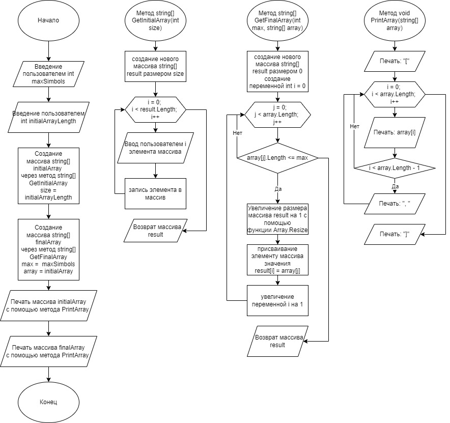

**Иготовая проверочная работа.**

**Задача**: Написать программу, которая из имеющегося массива строк формирует массив из строк, длинна которых меньше либо равна 3 символа. Первоначальный массив можно ввести с клавиатуры, либо задать на старте выполнения алгоритма. При решении не рекомендуется пользоваться коллекциями, лучше обойтись исключительно массивами.

**Решение**:

Решение я вижу при введение массива через клавиатуру поэлементно с помощью метода GetInitialArray. В этом случае на начальном этапе пользователь указывает сколько элементов будет содержаться в массиве. Затем после того как массив задан, он проходить проверку в методе GetFinalArray, для которого требуется указать так же максимальное допустимое число символов (для большей универсальности программы, данное занчение запрашивается сразу после запуска программы). Этот метод работает следующим образом, при переборе элементов первоначального массива проиходит проверка на максимальное число символов. Если в стоке собершится не больше учазанного кол-ва, то повый массив увеличивается на 1 элемент (первоначально он имеет 0 элементов), и новому элементу финального массива присваивается значение элемента первичного масссива, которое удовлетворяет тредованию. После работы метода GetFinalArray дважды запускается метод PrintArray которые выводит в консоль сначала initialArray, затем finalArray.

Блок схема: 

